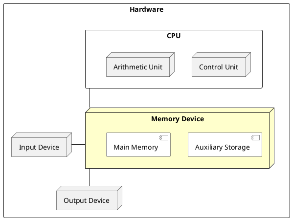

```plantuml
@startuml
rectangle Hardware {
  node "Memory Device" as MD #ffffcc {
    [Auxiliary Storage] #ffffff
    [Main Memory] #ffffff
  }
  rectangle CPU {
    node "Control Unit" as C
    node "Arithmetic Unit" as L
  }
  MD -u- CPU
  node "Input Device" as I
  node "Output Device" as O
  MD - I
  MD -- O
}
@enduml
```
