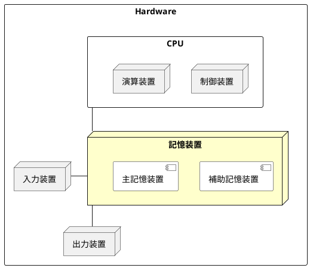

```plantuml
@startuml
rectangle Hardware {
  node 記憶装置 #ffffcc {
    [補助記憶装置] #ffffff
    [主記憶装置] #ffffff
  }
  rectangle CPU {
    node 制御装置 as C
    node 演算装置 as L
  }
  記憶装置 -u- CPU
  node 入力装置 as I
  node 出力装置 as O
  記憶装置 - I
  記憶装置 -- O
}
@enduml
```
